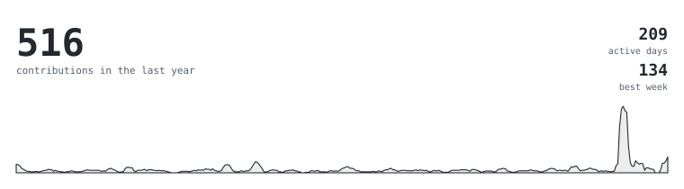
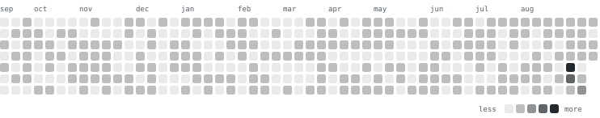

<picture>
  <source media="(prefers-color-scheme: dark)" srcset="assets/portrait-dark.svg">
  
</picture>

<picture>
  <source media="(prefers-color-scheme: dark)" srcset="assets/contributions-dark.svg">
  
</picture>

<picture>
  <source media="(prefers-color-scheme: dark)" srcset="assets/calendar-dark.svg">
  
</picture>

<a href="https://shreyas310805.github.io">shreyas310805.github.io</a> ·
<a href="https://www.linkedin.com/in/shreyas-tiwari">linkedin</a> ·
<a href="https://leetcode.com/u/mMrYb9OFae/">leetcode</a> ·
<a href="https://www.kaggle.com/shreyastiwari31">kaggle</a> ·
<a href="mailto:shreyastiwari0531@gmail.com">email</a>

## about

> **cs student at vit bhopal. small sharp tools over big vague ideas.**
>
> i build in python, mostly around llms — prompt engineering, retrieval, structured
> output — and the data pipelines that keep them honest. one algorithm problem a day,
> because a model is only as good as the reasoning feeding it.
>
> right now: squeezing a leaf-disease model down small enough to run on a
> solar-powered pi in a field.

## stack

|  |  |
|---|---|
| **languages** | `python` `java` `javascript` `php` `sql` |
| **ml** | `tensorflow` `keras` `tflite` `scikit-learn` |
| **data** | `numpy` `pandas` `matplotlib` `mysql` |
| **web** | `html` `css` `chart.js` `oauth 2.0` |
| **tools** | `git` `colab` `kaggle` `github pages` `raspberry pi` |

## projects

| | | |
|---|---|---|
| **[promptlib](https://github.com/Shreyas310805/promptlib)**   [live](https://shreyas310805.github.io/promptlib/) | 266 image prompts and 456 text templates, each shown as a finished result you click to reveal the prompt behind. no account, no backend. | `javascript` `static` |
| **[soybean](https://github.com/Shreyas310805/soybean-paper1)**   active | lightweight cnn benchmark across eight disease classes, quantized to an int8 build under 3 mb for a raspberry pi zero 2 w. | `python` `tensorflow` `tflite` |
| **[lifeos](https://github.com/Shreyas310805/LifeOS)** | task tracking and health analytics behind one shared state layer instead of two disconnected trackers. | `javascript` `chart.js` `oauth` |
| **[portfolio](https://shreyas310805.github.io)**   [live](https://shreyas310805.github.io) | multi-page dark-theme site, hand-built and deployed on github pages. | `html` `css` `js` |

## leetcode

## elsewhere

`photography` &nbsp; `digital art` &nbsp; `speedcubing` &nbsp; `the gym`

b.tech cse '26 · vit bhopal · open to software engineering and generative ai internships
